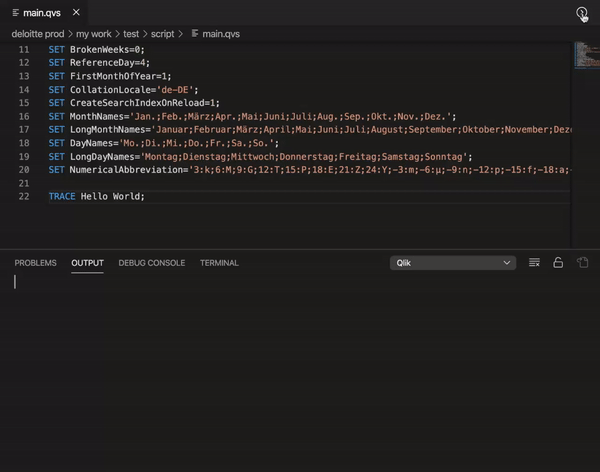
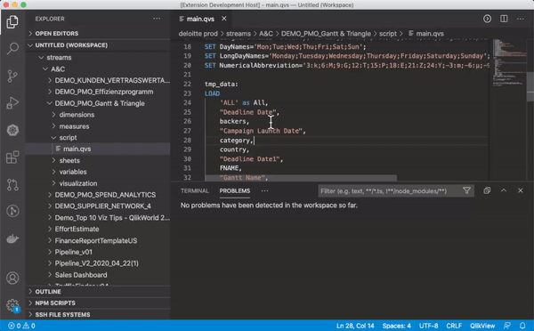

# Visual Studio Code - Qlik Extension

This extensions allows to use VSCode as an editor for Qlik Sense based systems.

It currently connects to:

- [x] Qlik Sense Desktop
- [x] Qlik Sense for Windows with Windows/NTLM
- [x] Qlik Core / Docker

Further authentications are on the roadmap and are tracked in issue [#283](/../../issues/283)

## Install

Search for "vscode-qlik" in VSCode Extension Marketplace or go to
the [Marketplace](https://marketplace.visualstudio.com/items?itemName=q-masters.vscode-qlik) and press Install.

## Usage

Video for script reload:

Video for script error checks:

### create new connection

- go to the window which was opened by vscode and press "CTRL + Shift + P" and search for "VSQlik: Show Connection Settings" and press enter.
- add new connection 
- save and close

### open connection

- press again "CTRL + Shift + P" and search for "VSQlik: connect to server"
- select the server and the Server will appear in the folder tree.

## Contribute / Debug

[Here](docs/contribute.md) you will find more howto compile the extension yourself.
