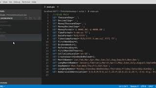

[](https://cla-assistant.io/q-masters/vsqlik)

[](https://www.codefactor.io/repository/github/q-masters/vsqlik)
[](https://marketplace.visualstudio.com/items?itemName=vsqlik.vsqlik)

# Visual Studio Code - Qlik Extension

## Starting with Development or just try Extension

This guide is only for Linux (Mac should be similiar), windows i never try so cant say.

### Requirements

- Docker: [Docker Install](https://docs.docker.com/install/) and follow the instructions.
- NodeJs: [NodeJS](https://nodejs.org/en/) very much straigt forward, i use the lts version
- VSCode: [VisualStudio Code](https://code.visualstudio.com/)

### Install

```bash
# ssh
git clone git@github.com:PLH-Coding/vsqlik.git
# or https
git clone https://github.com/PLH-Coding/vsqlik.git

# install dependencies
cd vsqlik/src && npm i
```

### Enable Qlik Engine on Docker

```bash
cd ~
mkdir qlik-docker

# everyone can read / write
sudo chmod 0777 -R qlik-docker
```

### Webview

before we can start the extension we need to have the compiled webview for connections, this could be done on 2 ways. This will create an angular application (connections, or more to come) as webview for vscode.

1. Way 

```bash
# install angular cli globally
npm i @angular/cli

cd ~/vsqlik/src/media/webview
ng build connection
```

2. Way

```bash
cd ~/vsqlik/src
npm run webview:build
```

### Start Docker Container

```bash
# start container (download if not allready exists) and map to: 127.0.0.1:9076
# if we create apps / or have apps we will find them in our directory ~/qlik-docker
docker run --volume ~/qlik-docker:/home/engine/Qlik/Sense -p 127.0.0.1:9076:9076 qlikcore/engine:12.556.0 -S AcceptEULA=yes -S BuildAppCacheAtStartup=1 
```

### Run extension

This extension is in development mode, so the only way to test this currently is running this extension in debug mode directly in vscode. To do this you need open vscode directly in the vsqlik directory or open the directory in vscode and press the key "F5" to start debug mode. This should open a new window.

> Important ! Ensure you dont have multiple Directories open since this would create a multi root workspace
> This will currently only work if you have the root directory openend

```bash
cd ~/vsqlik
code .
```

### Usage

Watch on youtube

[](https://www.youtube.com/watch?v=7MC_O8paHVE)

#### create new connection

- go to the window which was opened by vscode and press "CTRL + Shift + P" and search for "VSQlik: Show Connection Settings" and press enter.
- add new connection (remember 127.0.0.1:9076) which is what we run our docker container and map ports out
- disable secure (this docker container will not be)
- save and close

#### open connection

- press again "CTRL + Shift + P" and search for "VSQlik: connect to server"
- select 127.0.0.1:9076
- create new folder (enter a name and press enter)
