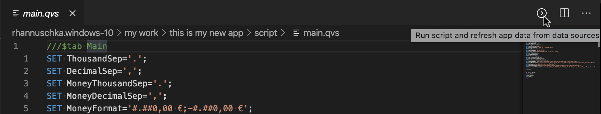

# Reload (Dataload) Script  

to reload (dataload) script just open the script file (main.qvs) in the editor now you have 2 options to load the data into your script.

- press the icon top left in the editor toolbar

- press *ctrl + p* and type: **VsQlik: Run...**

both the command and the icon will only be available if your have open a qvs file inside of your server directory.

After you pressed the icon or execute the command, a new virtual file should show up which shows you the result of your dataload. For every app it will create a new file.

